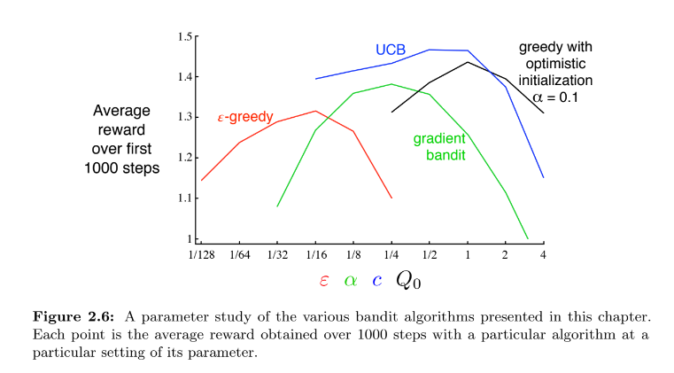

# Tabular Solution Methods

## Multi-armed Bandits Problem

Only a single state

### k-armed bandit

each of the k action has a mean (expected) reward, also called the value $q_{\*}(a) = \mathbb{E}\[R_t | A_t = a\]$ of the function. So $R_t$ is the reward obtained when performing $A_t$, while $q_{\*}(a)$ is the expected reward.

If you knew the value $q_{\*}$ for each action the problem would be trivial, just choose the action with highest values $q_{\*}$.

We can estimate $q_{\*}$. We denote the estimated value of the action $a$ at time $t$ as $Q_t(a)$, and we would like to have $Q_t(a)$ as close as possible to $q_{\*}$

- Greedy algorithm: at time $t$ select the action $a$ with greatest estimate $Q_t(a)$ of the value. You are doing just exploitation.

We need to balance exploration and exploitation.

### Action-Value Methods

Estimating $Q_t(a)$ and using the estimate to make action selection decision. We can estimate $Q_t(a)$ as the average of the reward actually received (sample-average method):

$$
Q_t(a) = \frac{\text{sum of rewards when a was taken, before t}}{\text{number of times a was taken before t}} = \frac{\sum_{i=1}^{t-1} R_i * 1_{A_i = a}}{\sum_{i=1}^{t-1} 1_{A_i = a}}. 
$$

If denominator is zero $Q_t(a)$ is a default value. **By the law of large number**, if the denominator diverges, $Q_t(a)$ goes to $q_t(a)$.


How can we use now the estimation? Select the action with the highest estimated value (greedy): $A_t = argmax_{a}Q_t(a)$

We can once in a while, with small probability $\epsilon$, select randomly from all the action, with equal probability. In this way we are doing exploration. This is called $\epsilon$-greedy methods. In this case the probability of selecting the optimal action converges to greater than $1 - \epsilon$, so near certainty.


$\epsilon$-greedy performs better than greedy with noisier rewards, where we need more exploration to find the optimal action. This is large variance of the reward. On the other hand, if the reward variances were zero, the greedy method would konw the true value of each action after trying it once, so it would be better. However, we are assuming that the bandit task were stationary, so the true values of the actions don't change over time. If we assume nonstationary bandit problem, we need exploration.


### Incremental Implementation

Okay so we estimate the value with sample-average methods. And we have two methods, the greedy and the $\epsilon$-greedy. Now let's talk about how we can capmoute the averages to compute $Q_t(a)$ in a computationally efficient manner. Precisely with constant memory and constant per-time-step computation. 

Let's consider only one action. Let $R_i$ denote the reward received after the $i$-th selction of the action, and let $Q_n$ be the estimate of the action value after being selected $n-1$ times. So basically:

$$
Q_n = \frac{R_1 + R_2 + ... + R_{n-1}}{n - 1}
$$

If we would maintain a record of all the rewards and perform computation each time, the computational requirements and memory would grow over time as more rewards are seen. We can write an incremental formula for updating:

$$
Q_{n+1} = Q_n + \frac{1}{n}\[R_n - Q_n\]
$$

having manipulated the first equation. This requires to store only $Q_n$ and $n$ and from the computational point of view is a simple operation to perform. This formula is actually in the common form:

$$
\text{New Estimate} \longleftarrow \text{Old Estimate} + \text{Step Size}\[\text{Target} - \text{Old Estimate}\]
$$

You can see $\[\text{Target} - \text{Old Estimate}\]$ as an error in the estimate. Pseudo code for the $\epsilon$-greedy bandit problem
```
Initialize for each action
Q(a) <- 0
N(a) <- 0

Loop forever:
A <- random action with prob $\epsilon$, argmax_a Q(a) with probability $1 - \epsilon$
R <- bandit(A), basically apply A
N(a) <- N(A) + 1
Q(A) <- update rule above
```


### Nonstationary bandit problem

The update rule for $Q_{n+1}(a)$ discussed above is appropriate for stationary bandit problem, i.e. the reward probabilities don't change over time.

When we have a nonstationary problem, it makes sense to give more weight to recent rewards than long-past one. We can do that by giving constant step-size to the previous update rule.

$$
Q_{n+1} = Q_n + \alpha [R_n - Q_n]
$$

Indeed, with some manipulation, this will lead to

$$
Q_{n+1} = (1 - \alpha)^n Q_1 + \sum_{i=1}^{n} \alpha * (1 - \alpha)^{n-i}R_i
$$

that is a weighted average of past rewards and the initial estimate $Q_1$ (the motivation for calling this weighted average are on the manual).

Note that, since $1 - \alpha$ is less than 1, the weight given to $R_i$ decreases as the number of rewards increases. So we actually gave more weight to recent rewards than long-past one. This is called exponential recency-weighted average. 


### Optimistic Initial Value: encouraging exploration with initial estimate

All the methods discussed so far are dependent on the initial action-value estimates $Q_1(a)$, so they are biased by their initial estimates. 

This means that the bias becomes a parameter that must be picked by the user. The upside is that they provide an easy way to supply some prior knowledge about what level of rewards can be expected. 


You can also use initial value to encourage exploration. For instance: in the k-th armed bandit we have initially set $Q(a) = 0$ for each action. What about setting them to +5? Recall that $q_{\*}(a)$ is selected from a normal distribution with mean 0 and variance 1. So initial estimate of +5 is wildly optimistic. This optimism encourages action-value methods to explore. Indeed, whichever action is chosen, its reward will be less than the starting estimate +5. So the learned will switch to other action, "disappointed" by the reward received. This means that all actions are tried several times. This holds also for greedy algorithm. 


Note that is is not well suited to nonstationary problems, because its drive for exploration is temporary (after convergence no more exploration). In nonstationary problem, the values change for we should renew the need for exploration, that is not possible with this method. 


### Upper-Confidence-Bound Action Selection (UCB)

$\epsilon$-greedy action selection forces the non-greedy action to be tried, but indiscriminately, with no preference for those that are nearly greedy or particularly uncertain. It would be better to select among the non-greedy actions **according to their potential for actually being optimal**, taking into account both how close their estimates are to being maximal and the uncertainties in those estimates. You can do that with:

$$
A_t = argmax_{a}\[Q_t(a) + c\sqrt(\frac{\ln(t)}{N_t(a)})\]
$$

Note that $N_t(a)$ is the number of times the action $a$ was chosen prior to time $t$. $c > 0$ controls the exploration.

The square root term is a measure of the uncertainty or variance in the estimate of the action value. Each time $a$ is selected the uncertainty is presumably reduced: $N_t(a)$ increments and so the uncertainty term decreases. On the other hand when an action that is not $a$ is chosen, $t$ increases and $N_t(a)$ doesn't, increasing the uncertainty.


### Gradient Bandit Algorithms

The model learns a numerical preference $H_t(a)$ for each action $a$. The larger the preference the more often the action is taken. The learning algorithm is based on the idea of stochastic gradient ascent. 


## Contextual Bandits (Associative Search)

So far we have considered **nonassociative** tasks, so task in which there is no need to associate different actions with different situations. Either the model find the single best action (stationary) or tries to track the best action as it changes over time (nonstationary). However, in general there is more than one situation and the goal is to learn a policy: a mapping from situations to the actions that are best in those situations. 

Example of associative search: your octopus facing the slot machine has now a clue on the identity of the task. The color of the display of the slot machine changes as the action values changes. Now you can learn an association between the state (color of the display) and the action (arm to pull). This association is called policy.

Associative search tasks are intermediate between the k-armed bandit problem (just 1 state) and the full reinforcement learning problem. Indeed, the involve a policy as the full RL problem, but each action affects only the immediate reward (as in the k-th armed bandit). On the contrary, if actions are allowed to affect the next situation as well as the reward, then we have the full RL problem. 


## Parameter study




You can see the characteristic inverted-U shapes: the algorithms perform best at an intermediate value of their parameter.


## Bayesian bandits, Gaussian Bayesian bandits, Thompson Sampling

The Bayesian methods assume a known initial distribution over the action values and update the distribution exactly after each step, assuming the true action values $q_{\*}$ are stationary. At each step, we can select the action according to their posterior probability of being the best action. This is called posterior sampling or Thompson sampling. In the Bayesian settings it is even conceivable to compute the optimal balance between exploration and exploitation, often approximated efficiently since the computation can be immense.
